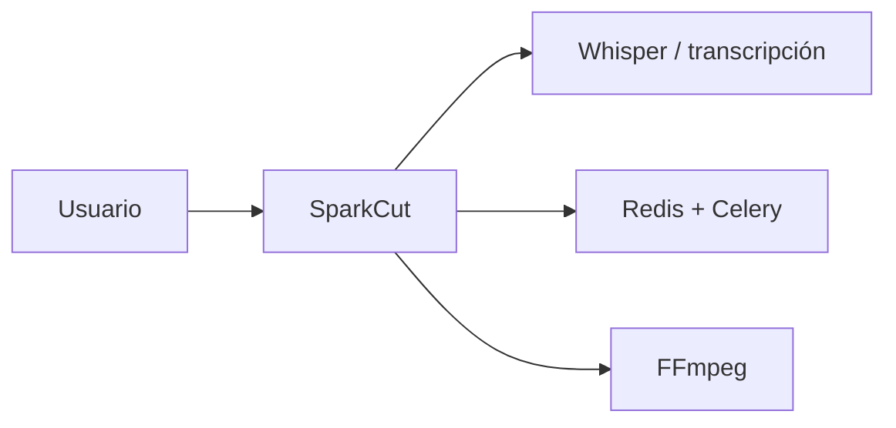
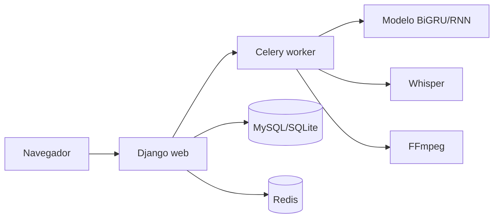
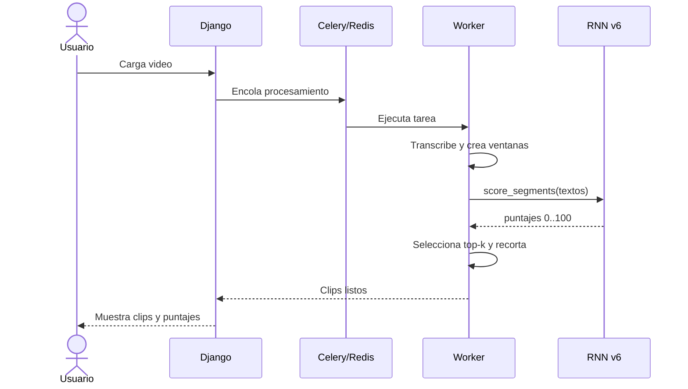

# Diagramas C4 y secuencia

## C4 nivel 1 — contexto

```mermaid
flowchart LR
  U[Usuario] --> S[SparkCut]
  S --> W[Whisper / transcripción]
  S --> R[Redis + Celery]
  S --> F[FFmpeg]
```

## C4 nivel 2 — contenedores

```mermaid
flowchart LR
  B[Navegador] --> D[Django web]
  D --> C[Celery worker]
  C --> M[Modelo BiGRU/RNN]
  C --> W[Whisper]
  C --> F[FFmpeg]
  D --> DB[(MySQL/SQLite)]
  D --> Q[(Redis)]
```

## Secuencia

```mermaid
sequenceDiagram
  actor Usuario
  participant Web as Django
  participant Cola as Celery/Redis
  participant Worker
  participant Modelo as RNN v6
  Usuario->>Web: Carga video
  Web->>Cola: Encola procesamiento
  Cola->>Worker: Ejecuta tarea
  Worker->>Worker: Transcribe y crea ventanas
  Worker->>Modelo: score_segments(textos)
  Modelo-->>Worker: puntajes 0..100
  Worker->>Worker: Selecciona top-k y recorta
  Worker-->>Web: Clips listos
  Web-->>Usuario: Muestra clips y puntajes
```
